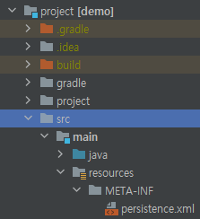

# 74p 객체 매핑 시작

---

## member를 먼저 db에 만들기

```mysql
CREATE DATABASE mydb;

use mydb;

CREATE TABLE member(
  id VARCHAR(255) PRIMARY KEY,
  name VARCHAR (255),
  age INTEGER
);
```
* 해당 소스로 member테이블을 만든다.

---

## 자바 프로젝트에 설정파일 추가하기


* 해당 프로젝트의 src/main/resources/META-INF아래에 persistence.png를 만듭니다.

### 내부 구조
```xml
<?xml version="1.0" encoding="UTF-8"?>
<persistence xmlns="http://xmlns.jcp.org/xml/ns/persistence" version="2.1">
    <persistence-unit name="jpabook">
        <!-- entity클래스 인식 -->
        <class>com.example.demo.ch2.Member</class>
        <properties>
            <!--필수 속성-->
            <property name="javax.persistence.jdbc.driver" value="com.mysql.cj.jdbc.Driver"/>
            <property name="javax.persistence.jdbc.user" value="root"/>
            <property name="javax.persistence.jdbc.password" value="root"/>
            <property name="javax.persistence.jdbc.url" value="jdbc:mysql://localhost:13306/mydb?characterEncoding=UTF-8&amp;serverTimezone=UTC"/>

            <!-- 하이버네이트 사용 시 다른 DB에서 MySQL 문법을 사용 가능하도록 변경.-->
            <property name="hibernate.dialect" value="org.hibernate.dialect.MySQL5Dialect"/>
            <!-- 콘솔에 SQL 출력 여부 -->
            <property name="hibernate.show_sql" value="true"/>
            <!-- 가독성 높여주는 formatting 여부 -->
            <property name="hibernate.format_sql" value="true"/>
            <!-- Comment 확인 여부 -->
            <property name="hibernate.use_sql_comments" value="true"/>
        </properties>
    </persistence-unit>
</persistence>
```

* persistence-unit : 나중에 자바소스에서 불러올 persistence의 이름입니다.
* class : 적용시킬 entity클래스입니다.
* properties
  * driver : 사용할 db의 드라이버입니다.
  * hibernate.dialect : 각 db마다 방언 문법들이 있는데 그걸 사용하겠다는 겁니다.
  * hibernate.show_sql : 해당 설정을 켜면 jpa동작시 로그에 만들어진 SQL을 보여줍니다.
  * hibernate.firmat_sql : sql을 출력할때 이를 들여쓰기를 해서 보여줍니다.

---

### Entity 객체 자바 코드 보기
```java
@Entity
@Table(name = "member")
@Data
public class Member {
    @Id
    @Column(name = "id")
    private String id;
    @Column(name = "name")
    private String userName;
    @Column
    private Integer age;
}
```
* 애너테이션 설명
  * Table : 객체 이름과 같으면 사실 생략할 수 있습니다.
    * 즉 위의 애너테이션은 자바객체와 db 테이블의 이름이 같기에 생략이 가능합니다.
    * 대소문자를 가릴경우 생략 불가
  * Entity : JPA로 관리할 객체임을 선언합니다.
  * Data : Lombok코드라서 무시해도됨
  * Id : 식별자가 될 필드입니다.
  * Column : 필드를 명시적으로 선언합니다. name을 적어야만 의미가 있고 안적으면 생략해도 됩니다.
    * 예를 들면 age에도 Column 애너테이션이 달려있는데 사실 이는 필요 없습니다.
      * 애니테이션이 없으면 알아서 이름에 맞춰서 매핑됩니다.
* 기타 설명
  * 프리미티브 래퍼클래스는 사실 안써도 됩니다.
    * 위의 예시를들면 Integer를 굳이 안쓰고 int를 써도 문제없이 동작합니다.