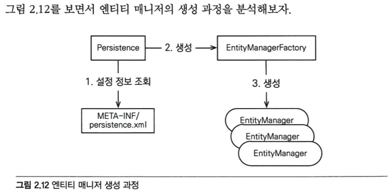

# 82p 엔티티 매니저

---

* persistence라는 개념이 뭔지 사실 잘 모르겠다(20220727WED1926)
* Persistence는 persistence.xml의 정보를 사용해서 만든다.
    * persistence안에는 db의 설정파일이 들어있다
    * EntityManager는 말그대로 개체(DB 인스턴스 -> 레코드)를 관리하는 녀석이다.
        * 근데 왜 EntityManagerFactory가 필요할까?(20220727WED1928)
            * 복수개가 필요할 수 있다고 생각은 한거 같은데 굳이?
            * 같은 이름의 persistnace를 여러개 만들 필요가 있을까?
* 여튼 EntityManager를 만들기 위해서는 반드시 EntityManagerFactory가 선행되야 한다.
    * EntityManagerFactory는 Persistence설정으로 만들기 때문에 아래와 같은 관계가 성립한다고 도불 수 있다.(맞다는건 아님 반박시 니말 맞음)
    * Persistence > EntityManagerFactory > EntityManager

