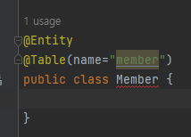
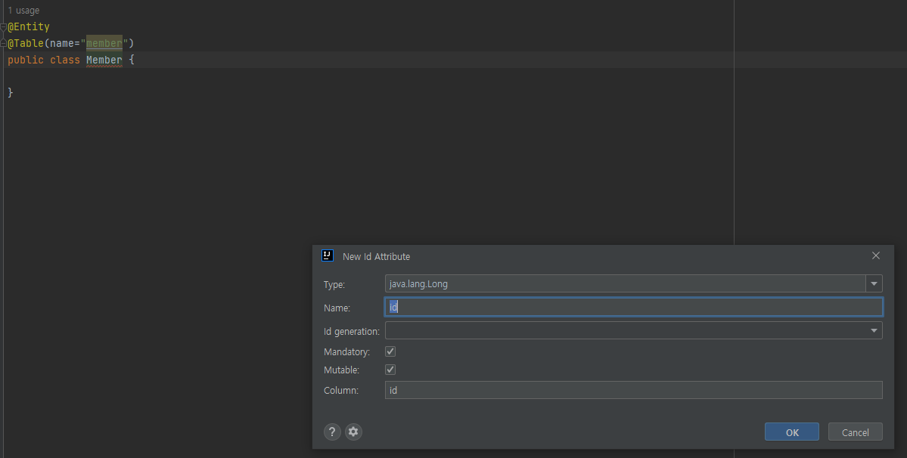
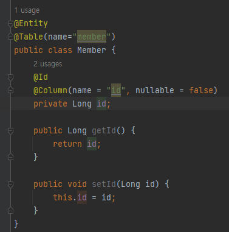
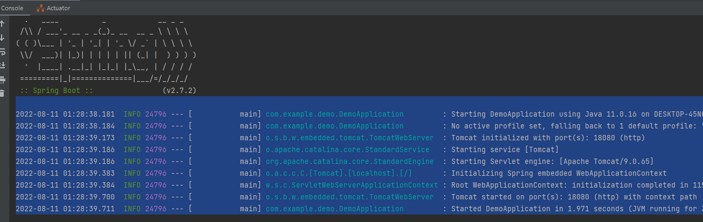
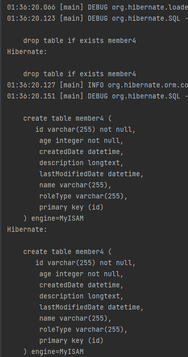
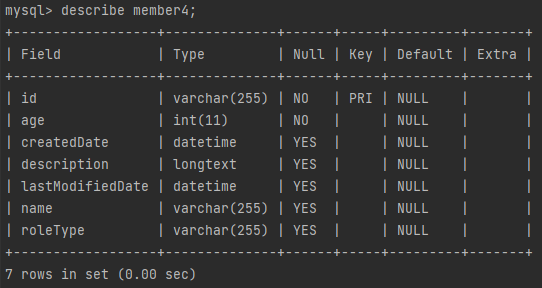

# 다양한 매핑 사용

---

## Jetbrains에디터 자동 완성


* 위처럼 JPA선언을 해주면 Jetbrains가 알아서 메세지를 띄어준다.


* 창이 뜨면서 추가적으로 어떤 애너테이션을 달지 물어본다.


* 이렇게 최종적으로 완성되는데 잘보면 id만 됨
  * 아마 db랑 직접 연결되는건 아닌듯?

---

## 테이블 자동 생성
```xml
<persistence-unit name="jpabook_ch4">
    <!-- entity클래스 인식 -->
    <class>com.example.demo.ch4.Member</class>
    <properties>
        <!--필수 속성-->
        <property name="javax.persistence.jdbc.driver" value="com.mysql.cj.jdbc.Driver"/>
        <property name="javax.persistence.jdbc.user" value="root"/>
        <property name="javax.persistence.jdbc.password" value="root"/>
        <property name="javax.persistence.jdbc.url" value="jdbc:mysql://localhost:13306/mydb?characterEncoding=UTF-8&amp;serverTimezone=UTC"/>

        <property name="hibernate.dialect" value="org.hibernate.dialect.MySQL5Dialect"/>
        <property name="hibernate.show_sql" value="true"/>
        <property name="hibernate.format_sql" value="true"/>
        <property name="hibernate.use_sql_comments" value="true"/>
<!--            스키마 자동생성 기능-->
<!--            애플리케이션 실행 시점에 데이터베이스를 자동으로 생성함-->
        <property name="hibernate.hbm2ddl.auto" value="create"/>

    </properties>
</persistence-unit>
```
* 위처럼 자동 생성을 해본다.


* jpa코드를 실행시키지 않고 그냥 main을 실행시키면 자동 실행되지 않는걸 확인할 수 있다.

```java
@Entity
@Table(name = "member4")
@Data
public class Member {
    @Id
    @Column(name = "id", nullable = false)
    private String id;

    @Column(name = "name")
    private String name;

    private int age;

    @Enumerated(EnumType.STRING)
    private RoleType roleType;

    @Temporal(TemporalType.TIMESTAMP)
    private Date createdDate;

    @Temporal(TemporalType.TIMESTAMP)
    private Date lastModifiedDate;

    @Lob
    private String description;
}
```
* 새로 객체를 만드는데 기존의 객체와 차이점이 몇개 있음
  * 4개의 새로운 컬럼이 추가됨
  * enum타입의 속성이 추가됨
  * date타입의 속성이 추가됨
  * Lob 애너테이션이 사용
* 위 JPA 설정으로 인해서 자동으로 table이 생성될것임

```java
public class Ch4MainCreate {
    public static void main(String[] args) {
        EntityManagerFactory emf = Persistence.createEntityManagerFactory("jpabook_ch4");
        EntityManager em = emf.createEntityManager();
        EntityTransaction tx = em.getTransaction();

        try {
            tx.begin();
            logic(em);
            tx.commit();
        } catch (Exception e) {
            e.printStackTrace();
            tx.rollback();
        } finally {
            em.close();
        }
        emf.close();
    }

    private static void logic(EntityManager em) {
        Member member = new Member();
        member.setId("KUKARO");
        member.setName("kukaro");
        member.setAge(20);
        em.persist(member);
        member.setAge(20);
    }
}
```
* 위의 코드를 실행해본다.
  * 여기서 엔티티 매니저는 jpabook이 아닌 새로만든 퍼시스턴트유닛인 jpabook_ch4를 사용한다.


* 영속성(퍼시스턴트)를 연결하는 순간 테이블이 없는데 우리는 설정으로 auto생성을 했으므로 자동 생성한다.
  * 여기서 있는 테이블은 드랍하는걸 확인할 수 있다.
  * 나도 이거 만들때 테이블이름 새로 정해줬는데 그렇게 할 필요는 없엇음
* 여기서 describe된것을 보면 몇가지 결과를 볼 수 있다.
  * enum은 varchar가 되었다.
    * 아마 enum type string을 해서 그런듯
  * temporal은 datetime이됨
  * Lob의 결과는 varchar가 아니라 longtext가 되었다.
* 근데 myisam으로 만드네... innodb로 만드는거 알아야할듯


* 다시 결과를 보자
  * 근데 결과를 보니까 age는 또 not null이네... 애너테이션 안붙히면 기본이 not null로 인식하나?
    * 만약 그렇다면 age는 일종의 value로 인식하는것일지도? 불변이거나.

---

## hibernate.hbm2ddl.auto 속성

* create : 기존 테이블 삭제하고 새로 생성 -> DROP + CREATE
* create-drop : 어플리케이션 종요할때 DDL 제거 -> DROP + CREATE + DROP
* update : 테이블과 엔티티 매핑정보를 비교해 변경사항만 수정
* validate : 테이블과 엔티티랑 비교해서 차이가 있으면 경고를 남기고 애플리케이션 실행 안함 -> DDL를 수정하지 않는다.

---

## hibernate.hbm2ddl.auto 주의 사항
* 실 서버에서는 DDL을 수정하는 옵션을 사용하지 말라고함
  * 아마 위험해서 그런듯