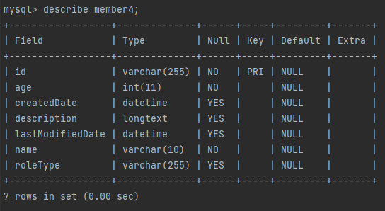
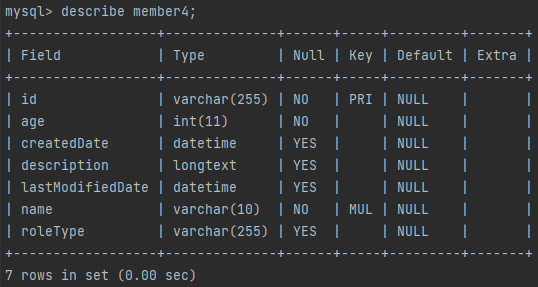
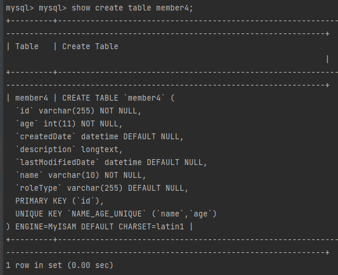

# DDL 생성 전략

---

```java
@Entity
@Table(name = "member4")
@Data
public class Member2 {
    @Id
    @Column(name = "id", nullable = false)
    private String id;

    @Column(name = "name", nullable = false, length = 10)
    private String name;

    private int age;

    @Enumerated(EnumType.STRING)
    private RoleType roleType;

    @Temporal(TemporalType.TIMESTAMP)
    private Date createdDate;

    @Temporal(TemporalType.TIMESTAMP)
    private Date lastModifiedDate;

    @Lob
    private String description;
}
```
* length와 nullable을 지정해 줄 수 있다.

```xml
<persistence-unit name="jpabook_ch4_2">
    <!-- entity클래스 인식 -->
    <class>com.example.demo.ch4.Member2</class>
    <properties>
        <!--필수 속성-->
        <property name="javax.persistence.jdbc.driver" value="com.mysql.cj.jdbc.Driver"/>
        <property name="javax.persistence.jdbc.user" value="root"/>
        <property name="javax.persistence.jdbc.password" value="root"/>
        <property name="javax.persistence.jdbc.url" value="jdbc:mysql://localhost:13306/mydb?characterEncoding=UTF-8&amp;serverTimezone=UTC"/>

        <property name="hibernate.dialect" value="org.hibernate.dialect.MySQL5Dialect"/>
        <property name="hibernate.show_sql" value="true"/>
        <property name="hibernate.format_sql" value="true"/>
        <property name="hibernate.use_sql_comments" value="true"/>
        <!--            스키마 자동생성 기능-->
        <!--            애플리케이션 실행 시점에 데이터베이스를 자동으로 생성함-->
        <property name="hibernate.hbm2ddl.auto" value="create"/>

    </properties>
</persistence-unit>
```
* 새로 퍼시스턴트 선언해준다. class를 바꿔줌


* name도 nullable이 된걸 확인할 수 있다.

```java
@Entity
@Table(name = "member4",
        uniqueConstraints = {@UniqueConstraint(
                name = "NAME_AGE_UNIQUE",
                columnNames = {"name", "age"}
        )})
@Data
public class Member3 {
    @Id
    @Column(name = "id", nullable = false)
    private String id;

    @Column(name = "name", nullable = false, length = 10)
    private String name;

    private int age;

    @Enumerated(EnumType.STRING)
    private RoleType roleType;

    @Temporal(TemporalType.TIMESTAMP)
    private Date createdDate;

    @Temporal(TemporalType.TIMESTAMP)
    private Date lastModifiedDate;

    @Lob
    private String description;
}
```
* 이번에는 constraints를 만들어본다.
  * unique임
  * 위의 예제는 name과 age로 multi unique 키를 만든 예시이다.


* 보면 MUL로 생성됬음을 알 수 있다.
  * MUL은 mysql에서 멀티인덱스의 첫번째 컬럼을 의미함


* 더 자세한건 위명령어로 알 수 있음.
