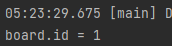
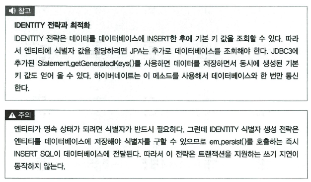

# IDENTITY 전략

---

* 주로 MySQL, PostgreSQL, SQL Server, DB2에 사용하는 전략이라고 한다
  * 그럼 오라클 빼고 다 쓰는거 아닌가?

```mysql
create table board (
    id int not null auto_increment primary key,
    data varchar(255)
);

insert into board(data) values('A');
insert into board(data) values('B');
```
* 위의 값을 넣고 나서 확인을 해보자


```java
@Entity
@Data
public class Board {
    @Id
    @GeneratedValue(strategy = GenerationType.IDENTITY)
    private Long id;
}
```
* 객체를 선언할 때 GeneratedValue를 넣고  strategy를 IDENTITY를 정해주면 autoincrement가 동작한다
  * 그럼 오라클에서는 시퀀스를 정해줘야하나 싶긴함... 아니면 자동으로 될라나?
* 이거사용할때 중요한건 애너테이션 Table로 이름을 안정해주면 Board라는 이름으로 들어가는데 문제는 대소문자를 구별한 Board가 요청된다는 것이다.

```java
public class Ch4MainCreate4 {
  public static void main(String[] args) {
    EntityManagerFactory emf = Persistence.createEntityManagerFactory("jpabook_ch4_4");
    EntityManager em = emf.createEntityManager();
    EntityTransaction tx = em.getTransaction();

    try {
      tx.begin();
      logic(em);
      tx.commit();
    } catch (Exception e) {
      e.printStackTrace();
      tx.rollback();
    } finally {
      em.close();
    }
    emf.close();
  }

  private static void logic(EntityManager em) {
    Board board = new Board();
    em.persist(board);
    System.out.println("board.id = " + board.getId());
  }
}
```
* 결과를 출력해보자.


* 근데 이거 신기한게 요청할때 마다 테이블 드랍하는거 같은데?
  * 아 이게 설정이 hibernate.hbm2ddl.auto이 create면 무조건 들랍을 하는구나..
* identity는 기본키를 받아오기 위해서 다시 데이터베이스에 접근한다


* 책의 설명