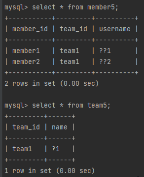
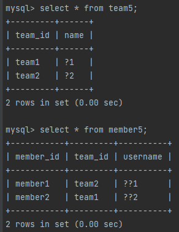

# 연관 관계

---

* 엔티티들은 대부분 다른 엔티티와 연관관계가 있다.
  * 객체 관계 매핑(ORM)에서 가장 어려운 부분이 바로 객체 연관관계와 테이블 연관관계를 매핑하는 일이다.
* 방향(Direction)
  * 방향은 단방향과 양방향이 있다.
  * 회원 -> 팀 같이 한쪽만 참조하는것을 단방향이라고한다.
  * 회원 -> 팀, 팀 -> 회원 같이 양쪽에서 서로 참조하는 것을 양방향 관계라 한다.
* 다중성(Multiplicity)
  * 가능한 종류
    * 다대일(N:1)
    * 일대다(1:N)
    * 일대일(1:1)
    * 다대다(N:M)
* 연관관계의 주인(Owner)
  * 객체를 양방향 연관관계로 만들면 연관관계의 주인을 정해야한다.
* 객체 연관관계 vs 테이블 연관관계
  * 참조를 사용하는 객체의 연관관계는 단방향이다
    * 이것은 양방향으로 만들어도 그건 단방향을 양쪽으로 하는 것이다
  * 외래 키를 사용하는 테이블의 연관관계는 양방향이다.

---

## 수정(update) - 177p

* 먼저 위처럼 데이터 베이스의 값이 있다고 가정하자
  * member1은 team1에 속해있다.

```java
private static void logic(EntityManager em) {
    //새로운 팀2
    Team team2 = new Team("team2", "팀2");
    em.persist(team2);

    //회원1에서 새로운 팀 2설정
    Member member = em.find(Member.class, "member1");
    member.setTeam(team2);
}
```
* 팀을 새로 만들어서 만든다.(persist)
* 그 후 setTeam으로 연결시켜주면 다른 메소드를 호출하지 않아도 연결된다.


* 값이 연결되서 변경된걸 확인할 수 있다.