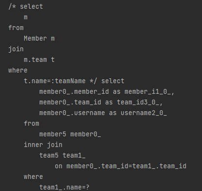
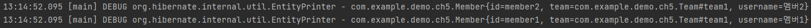

# JPQL

---

* 연관관계가 있는 엔티티를 조회하는 방법은 2가지임
  * 객체 그래프 탐색
  * 객체지향 쿼리 사용(JPQL)
* JPQL은 객체지향 쿼리라고함
  * Java Persistence Query Language

```java
@Slf4j
public class Ch5MainJPQL {
    public static void main(String[] args) {
        EntityManagerFactory emf = Persistence.createEntityManagerFactory("jpabook_ch5");
        EntityManager em = emf.createEntityManager();
        EntityTransaction tx = em.getTransaction();

        try {
            tx.begin();
            logic(em);
            tx.commit();
        } catch (Exception e) {
            e.printStackTrace();
            tx.rollback();
        } finally {
            em.close();
        }
        emf.close();
    }

    private static void logic(EntityManager em) {
        String jpql = "select m from Member m join m.team t where t.name=:teamName";
        List<Member> resultList = em.createQuery(jpql,Member.class)
                .setParameter("teamName","팀1")
                .getResultList();
        resultList.forEach(member -> {
            log.info("[query] member.username = {}",member.getUsername());
        });
    }
}
```
* JQPL 부분만 떼어놓고보면 아래와 같다

```java
String jpql = "select m from Member m join m.team t where t.name=:teamName";
```
* 일반 문법과의 차이점은 여기서는 두개가 보인다
  * select 뒤에 alais된 테이블 이름이 들어간다
    * 책에서 아직 설명하지 않는다
    * 다만 객체를 일부만 로딩하지 않아서 그런것 같기는 하다
  * join에서 테이블을 조인하지 않고 member가 가진 team을 조인한다
    * 아마 객체를 연결한다 이런 개념인거 같다

```java
List<Member> resultList = em.createQuery(jpql, Member.class)
        .setParameter("teamName", "팀1")
        .getResultList();
```
* setParameter를 사용해서 바인드 변수로 지정한 것의 값을 줄 수 있다.


* 결과를 보면 해당 JPQL이 어떻게 번역됬는지 알 수 있다
  * member5는 member0_로 alias되어 있다.
  * team5는 team1_로 alias되어 있다.
  * 그 외에도 대부분 alias되어있는 채로 사용된다.


* 검색이 제대로 되는걸 확인할 수 있다.