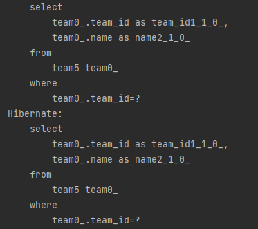
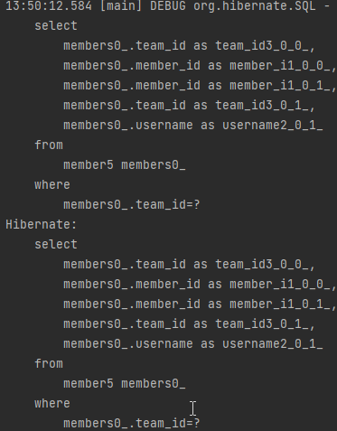
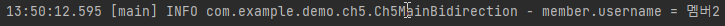

# 양방향 연관관계

---

* 먼저 Member와 Team의 상황을 보자

```java
@Entity
@Table(name = "member5")
@Data
@NoArgsConstructor
@AllArgsConstructor
public class Member {
    @Id
    @Column(name = "member_id")
    private String id;

    private String username;

    @ManyToOne
    @JoinColumn(name = "team_id")
    private Team team;

    public Member(String id, String username) {
        this.id = id;
        this.username = username;
    }
}
```
* Member에서 보면 Team이 다대일관계로 연결되어 있음을 알 수 있다.
  * 또한 Join Column으로 데이터베이스에서 실질적으로 연결되어 있음을 알 수 있다.

```java
package com.example.demo.ch5;

import lombok.AllArgsConstructor;
import lombok.Data;
import lombok.NoArgsConstructor;

import javax.persistence.Column;
import javax.persistence.Entity;
import javax.persistence.Id;
import javax.persistence.Table;

@Entity
@Table(name = "team5")
@Data
@NoArgsConstructor
@AllArgsConstructor
public class Team {
    @Id
    @Column(name = "team_id")
    private String id;

    private String name;
}
```
* Team의 경우 개념적으로는 Member와 연결되어있으나 실질적으로 DB에서 연결은 없음
  * DB에서는 Member가 Team을 명시적으로 가지고 있음, 즉 명시적 연결이 있음
* JPA에서는 연결당하는 쪽인 Team도 연결시켜줄 수 있음

```java
@Entity
@Table(name = "team5")
@Data
@NoArgsConstructor
@AllArgsConstructor
public class Team {
    @Id
    @Column(name = "team_id")
    private String id;

    private String name;
    
    @OneToMany(mappedBy = "team")
    private List<Member> members = new ArrayList<>();
}
```
* 이번에는 Table쪽에서 OneToMany로 역으로 연결해주자
  * 여기서 mappedBy에 이어줄 이름은 DB테이블의 이름도, DB컬럼의 이름도, 객체의 이름도 아니다.
  * 이 이름은 Member쪽의 property이름임
* 이제 연결되서 조회 가능

```java
private static void logic(EntityManager em) {
    Team team = em.find(Team.class, "team1");
    team.getMembers().forEach(member -> {
        log.info("member.username = {}", member.getUsername());
    });
}
```
* 이제 team을 통해서 역으로 member들을 호출할 수 있다.
  * 이건 JPA의 특장점중 하나라 할 수 있을것 같다.


* 실행해보면 먼저 team을 쿼리요청으로 가져오는걸 알 수 있다.


* 그 때 얻은 team 값으로 member를 가져온다.


* 값이 하나밖에 없긴한데 효괒거으로 값을 가져올 수 있다.