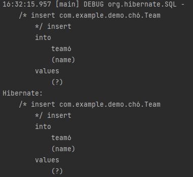
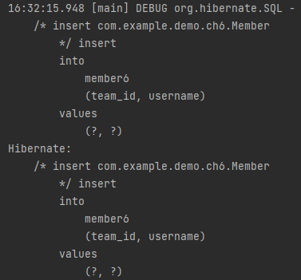
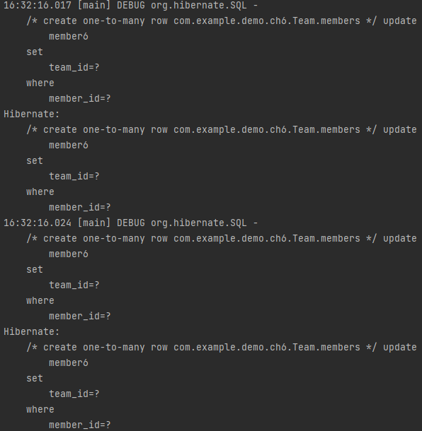
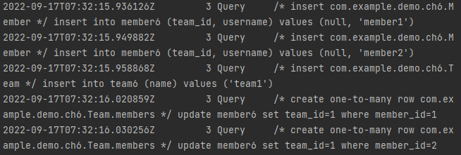

# 일대다

---

* 일대다 관계는 연관관계의 주인이 외부에 있다.

```java
package com.example.demo.ch6;

import lombok.AllArgsConstructor;
import lombok.Data;
import lombok.NoArgsConstructor;

import javax.persistence.*;
import java.util.ArrayList;
import java.util.List;

@Entity
@Table(name = "team6")
@Data
@NoArgsConstructor
@AllArgsConstructor
public class Team {
    @Id
    @GeneratedValue(strategy = GenerationType.IDENTITY)
    @Column(name = "team_id")
    private long id;

    private String name;

    @OneToMany
    @JoinColumn(name = "team_id")
    private List<Member> members = new ArrayList<>();

    public Team(String name) {
        this.name = name;
    }

    public Team(long id, String name) {
        this.id = id;
        this.name = name;
    }

    public void addMember(Member member) {
        this.members.add(member);
        if (member.getTeam() != this) {
            member.setTeam(this);
        }
    }
}
```
* JoinColumn을 추가하고 해당 fk를 적어준다.
  * 해당 애너테이션을 사용하지 않으면 조인테이블 전략을 사용한다고한다
  * 아직 안나와서 모르겠음
```
[mysqld]
general_log=ON
log_output=FILE
general_log_file=/var/log/mysql/general/mysql_general.log
```
* 실행 쿼리를 확인하기 위해서 mysql에 설정해준다.
```java
private static void logic(EntityManager em) {
    Member member1 = new Member("member1");
    Member member2 = new Member("member2");

    Team team1 = new Team("team1");
    team1.getMembers().add(member1);
    team1.getMembers().add(member2);

    em.persist(member1);
    em.persist(member2);
    em.persist(team1);
}
```
* 해당 로직을 시행해본다.




* 실행 로그 결과를 team과 member를 먼저 만든 이후 fk를 연결해준다.


* mysql log를 보면 더 정확히 알 수 있다.
* one-to-many를 주석으로 넘긴것도 확인할 수 있다.